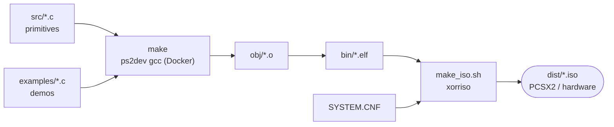

# ps2tech

Shared PlayStation 2 platform primitives for retro id-tech-style ports —
**ps2oom** (DOOM), **ps2quake** (Quake), **ps2uke** (Duke3D). All three are
8-bit-palettized, software-rendered games with identical PS2 needs, and each
currently reimplements the same platform layer from scratch. ps2tech distills
that layer into one place so a fourth port (or a fix to an old one) is cheap.

## Status: initial extraction (read-only copy)

This is a **straight copy** from the existing ports, not yet refactored into
clean game-agnostic primitives. A Dockerized ps2dev build harness is now wired
up (see **[Building](#building)**), but so far only the **menu** primitive has a
buildable example — the rest of `src/` still needs distilling, and the source
ports are untouched. The next pass distills `reference/` down into the `src/`
primitives and gives them a small public API.

```
ps2tech/
├── Dockerfile          ps2dev toolchain (+ make/bash/xorriso) in a container
├── docker-compose.yml  ─┐ convenience wrappers around the image
├── build.sh            ─┘   ./build.sh -> bin/ps2menu_example.elf
├── Makefile            builds src/ + examples/ -> obj/ -> bin/
├── make_iso.sh         packs an ELF + SYSTEM.CNF -> dist/*.iso (xorriso)
├── SYSTEM.CNF          PS2 boot stanza (boots cdrom0:\PS2MENU.ELF)
├── docs/architecture.md   runtime/boot flow + cdfs data-discovery (mermaid)
├── examples/
│   └── ps2menu_example.c    in-process demo of the menu primitive (the smoke test)
├── src/            clean-ish primitives copied from ps2oom (the starting point)
│   ├── ps2_audio_driver.c   audsrv bring-up: lmb patch -> libsd/audsrv IRX -> audsrv_init
│   ├── ps2_bootscr.c        libdebug GS text console for the boot log
│   ├── ps2_drivers_stub.c   THE boot fix: override waitUntilDeviceIsReady (~28s
│   │                          stall) + stub unused USB/dev9 drivers
│   ├── ps2_cdfs.c           cdfs (ISO9660) bring-up for on-demand disc reads
│   ├── ps2_menu.c/.h         controller-driven setup menu (list + settings page)
│   └── ps2_pad.c            libpad: forced analog, sticks + buttons (DOOM-mapped;
│                              the mapping needs degenericising)
└── reference/      game-coupled sources to distill the primitives FROM
    ├── doom/   i_audsrvsound.c (audsrv mixer loop), doomgeneric_ps2_gs.c
    │           (gsKit 8bpp blit), opl_ps2.c (DBOPL render), w_file_cdfs.c
    └── quake/  snd_ps2.c, vid_ps2.c (gsKit), in_ps2.c (USB kb+m!), cd_ps2.c
```

Having **two** reference implementations per primitive (doom/ + quake/) is the
point: the common core is whatever they agree on.

## Building

The toolchain runs in Docker, layered on the official
[ps2dev](https://github.com/ps2dev/ps2dev) image (`mips64r5900el-ps2-elf-gcc` +
ps2sdk + gsKit) with `make`/`bash` added so it builds out of the box:

    ./build.sh           # build the image (first run), then compile -> bin/ps2menu_example.elf
    ./build.sh clean     # remove obj/ and bin/
    ./build.sh shell     # interactive shell in the toolchain

`build.sh` runs the container as your host user, so `obj/`/`bin/` aren't
root-owned. `docker compose run --rm ps2dev make` does the same thing.

The build target is **`bin/ps2menu_example.elf`** — a standalone demo of the
**menu** primitive: a controller-driven list picker plus a settings page on the
libdebug console. It links only `src/ps2_menu.c` (the one pad bring-up call the
menu makes is inlined in the example, since `src/ps2_pad.c` is still
Doom-coupled). It does **no** file I/O and needs no disc — the IRX it loads
(SIO2MAN/PADMAN) come from `rom0:`, so it runs straight in PCSX2 or on hardware.

Note the menu is an **in-process** widget, *not* a launcher: a game calls
`PS2_SelectMenu()` inside its own `main()`, gets back a choice, and the *same*
ELF keeps booting with it. It never `LoadExecPS2`'s a second ELF — that would
reset the machine and force the next ELF to re-init everything (RPC, every IRX,
drivers) from scratch. Disc/file access is a *separate* primitive: `ps2_cdfs.c`
(driver bring-up) plus the fio-based readers still in `reference/`
(`doom/w_file_cdfs.c`, `quake/cd_ps2.c`).

As more primitives are degenericised, add their `src/*.c` to `EE_OBJS` and the
ps2sdk libs they need to `EE_LIBS` in the `Makefile`, and add demos under
`examples/`.

### Bootable ISO

`make_iso.sh` packs a built ELF + `SYSTEM.CNF` into a bootable PS2 disc image
with `xorriso` (now part of the toolchain image — after pulling this change,
rebuild it once: `docker build -t ps2dock:local .`). It's modeled on ps2quake's
`make_iso.sh`, the most built-out of the source ports' ISO scaffolding:

    ./make_iso.sh                     # bin/ps2menu_example.elf -> dist/ps2menu_example.iso
    ./make_iso.sh bin/foo.elf         # any ELF                 -> dist/foo.iso
    ./make_iso.sh bin/foo.elf data/   # also copy a data dir onto the disc root

The chosen ELF is placed on the disc as `PS2MENU.ELF`, which `SYSTEM.CNF` boots
(`cdrom0:\PS2MENU.ELF`, NTSC — flip to PAL in one line). For a data-heavy port
that streams big WADs/PAKs off the disc, ps2oom's `build.sh iso` instead grafts
them in with `mkisofs -graft-points` (no staging copy) — fold that in when an
example needs it.

### Pipeline



## The primitives to extract

| Primitive | What it does | Distill from |
|---|---|---|
| **audio** | audsrv bring-up + a mixer thread that does `audsrv_wait_audio` → `audsrv_play_audio` (the blocking call self-paces). `ps2tech_audio_open(fmt)` / `ps2tech_audio_submit(pcm, n)`. | `src/ps2_audio_driver.c`, `reference/{doom/i_audsrvsound,quake/snd_ps2,quake/cd_ps2}.c` |
| **video** | 8-bit palettized framebuffer → PSMT8 texture + CLUT, GS upscale. `ps2tech_blit8(fb, pal)`. | `reference/{doom/doomgeneric_ps2_gs,quake/vid_ps2}.c` |
| **input** | libpad (forced analog) + USB keyboard/mouse. `ps2tech_pad_read()`, `ps2tech_kbd_*`. | `src/ps2_pad.c`, `reference/quake/in_ps2.c` |
| **boot** | driver bring-up + the `waitUntilDeviceIsReady` fix + libdebug console. | `src/ps2_drivers_stub.c`, `src/ps2_bootscr.c` |
| **storage** | cdfs / on-demand file reads (WAD / PAK / GRP). | `src/ps2_cdfs.c`, `reference/doom/w_file_cdfs.c` |
| **menu** | controller setup menu (already fairly game-agnostic). | `src/ps2_menu.c/.h` |

The **audio** primitive is the highest priority — it's what ps2uke is stuck on,
and there are already two proven copies to distill from.

## What stays per-game

Only the platform open/submit/blit/read is shareable. The actual *mixing* and
*decoding* stay in each game (DOOM mixes SFX + DBOPL FM; Quake decodes
IMA-ADPCM; Duke does VOC + its own music), as does the input *mapping*.

## Architecture

For the boot/runtime sequence these primitives serve — and the cdfs init +
data-discovery flow (how a port finds its WAD/PAK/GRP on the disc) — see
[docs/architecture.md](docs/architecture.md).

## Provenance

Copied from `Arawn-Davies/ps2oom` (ps2/) and the local ps2quake tree.
Built on [ps2sdk](https://github.com/ps2dev/ps2sdk) + gsKit (ps2dev), GPLv2.
