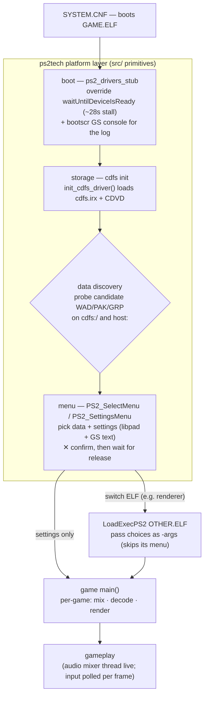
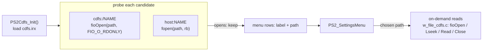

# ps2tech architecture

How the shared primitives fit together and the boot/runtime sequence they serve.
For the build harness and ISO packaging see the [README](../README.md); this is
the deeper PS2-internals reference (modeled on ps2oom's `ps2/README`).

## Runtime flow: the boot sequence

Every port has the same shape. ps2tech owns the platform steps (boot, storage,
menu, audio, video, input); each game supplies only its own data, mixing, and
decoding.

The platform boxes are exactly the `src/` primitives; the game box is what stays
per-game (see [What stays per-game](../README.md#what-stays-per-game)).

## Storage: cdfs init + data discovery

This is the least obvious part, so it's worth spelling out. **`ps2_menu.c` does
no file I/O** — it draws a list and returns an index. The disc work is the
*storage* primitive, and a thin per-game step decides what goes into that list.

### cdfs bring-up

`src/ps2_cdfs.c`'s `PS2Cdfs_Init()` calls `init_cdfs_driver()`, which loads
`cdfs.irx` (+ CDVD). It's idempotent and quick — quick *because* the boot fix
(`ps2_drivers_stub.c`) removed the ~28 s `waitUntilDeviceIsReady` stall; with no
disc present, every probe below simply fails instead of hanging.

### Finding the data files — a probe list, not a directory scan

cdfs is a **legacy ioman device**: `fopen` can't reach it and there's no clean
`readdir`. So discovery does *not* enumerate the disc — it **probes a fixed list
of candidate filenames** and keeps the ones that open. ps2oom's `ps2_iwad.c`
(`PS2_GetIWAD`) is the reference:

- **cdfs candidates** (`cdfs:/DOOM.WAD`, `cdfs:/DOOM2.WAD`, …) are tested with
  `PS2Cdfs_Exists(path)` → `fioOpen(path, FIO_O_RDONLY)` — the only open that
  reaches cdfs. (`FIO_O_RDONLY == 0`, so a plain `fopen` silently fails on it.)
- **hostfs candidates** (`host:DOOM.WAD`, … — e.g. PCSX2's mapped folder next to
  the ELF) are tested with `fopen(path, "rb")`; `host:` *is* libc-reachable.
- Whatever opens becomes a `{label, path}` row, and the rows are handed to
  `PS2_SettingsMenu`. An embedded copy (`EMBED_WAD`) is appended as a fallback,
  and "no data found" halts with a message rather than dropping to the PS2 BIOS.

Once chosen, the file is read **on demand** (seek + read per request) by
`w_file_cdfs.c` (DOOM WAD); Quake's `cd_ps2.c` streams music tracks the same way.
Nothing is slurped whole. That reader is the other half of the storage
primitive, still in `reference/` until it's distilled into `src/`.

### A renderer switch is the only multi-ELF case

When the menu's choice means a *different* ELF (ps2oom switches renderer),
`PS2_GetIWAD` calls `LoadExecPS2(other.elf, …, -iwad/-pwad/-music/…)`. That
**resets the machine** — the new ELF re-inits everything (RPC, every IRX, cdfs)
from scratch, and skips its own menu because the choices arrive as args. This is
why the menu is otherwise kept *in-process*: a normal launch reuses the one
bring-up already done, instead of paying for it again.

### Distill-from

| Piece | Source |
|---|---|
| cdfs driver bring-up | `src/ps2_cdfs.c` (`init_cdfs_driver`) |
| candidate probe + menu wiring | ps2oom `ps2/ps2_iwad.c` (`PS2_GetIWAD`, `PS2Cdfs_Exists`) |
| on-demand reader (fio) | `reference/doom/w_file_cdfs.c`, `reference/quake/cd_ps2.c` |
| the menu widget it drives | `src/ps2_menu.c` |
